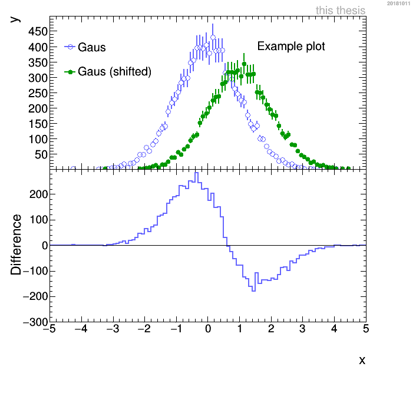

# RootCanvasCreator
A advanced plotting macro, that creates beautiful canvases

# Usage
The macro is used by calling the **newCanvas()** function.
The function takes `TObjArrays`, that have to contain a `TH1` as the first entry to draw many Root Objects on a new canvas.
The following objects are supported:

 - TH1
 - TPaveText
 - TLine
 - TLegend
 - TBox
 - TGraph
 - TGraphAsymErrors
 
The shape of the canvas is modified by a control string.
This is a little unelegant, but highly versitile ( `ControlString.Contains()` is used to check the string ).
Following canvas versions are supported:

 - Horizontal
 - Square
 - SplitHalf
 - FullPage
 
For the Axes following options are availiable:

 - BinLabels
 - CenterTitle
 - LogX
 - LogY
 - RatioGridY
 
Further more the option *ThisWork* will add a lable to the figure, *CMYK* will alter the colors to be more print friendly, *Thick* and *Thin* will change the linewidth and *Fill* can be used to fill the space below a line.
By default a time stamp is created in the top right corner.
This can be prevented with the *NoTime* option.

The color and markerstyles are controled via two *Short_t* array.

To include the macro into your macros use `gROOT->LoadMacro("CanvasCreator.C");`.
And call it via 
```
TCanvas *cnvs = makeCanvas(array_one,array_two,"ControlString",colors,marker); 
cnvs->Draw();
```



# Published figures
The ALICE Collaboration: *"Transverse momentum spectra and nuclear modification factors of charged particles in Xe-Xe collisions at
 $\sqrt{s_{\rm NN}}$ = 5.44 TeV"*, arXiv: [1805.04399](https://arxiv.org/abs/1805.04399)
 


